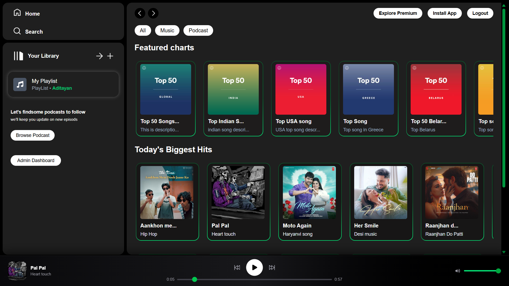
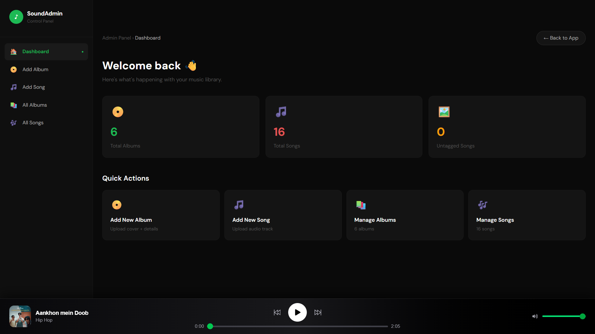

<div align="center">


# 🎵 Spotify Clone

### A full-stack music streaming platform inspired by Spotify  
Built with **Microservices Architecture** — featuring a user-facing frontend, admin dashboard, and independent backend services for songs and users.

<br/>

[](https://react.dev/)
[](https://www.typescriptlang.org/)
[](https://nodejs.org/)
[](https://expressjs.com/)
[](https://www.mongodb.com/)
[](https://tailwindcss.com/)
[](https://redux-toolkit.js.org/)
[](https://cloudinary.com/)
[](https://vercel.com/)
[](https://render.com/)

</div>

---

## 📸 Screenshots

### 🏠 Home Page


### 🛠️ Admin Dashboard


---

## ✨ Features

### 🎧 User Side
- 🎵 Stream songs with smooth audio playback
- 🔍 Search tracks, albums, and artists in real-time
- 🎨 Beautiful Spotify-inspired UI with Tailwind CSS
- 📱 Fully responsive — works on all screen sizes
- 🔐 Secure login & registration with JWT authentication
- ⚡ Fast state management with Redux Toolkit & Context API

### 🛠️ Admin Dashboard
- 📤 Upload songs and album art to Cloudinary via Multer
- 🗂️ Create and manage albums with full CRUD operations
- 📊 Dashboard overview of all platform content
- 🔐 Protected admin-only routes

### ⚙️ Backend Services
- 🏗️ Microservices architecture — each service runs independently
- 🔗 RESTful APIs with Express and Mongoose
- ☁️ File uploads handled by Multer + Cloudinary
- 🔒 JWT-based authentication across services

---

## 🏗️ Architecture Overview

```
Spotify-Clone/
│
├── 🖥️  frontend/           # React 18 + TypeScript user app
│       ├── src/
│       │   ├── components/ # Reusable UI components
│       │   ├── pages/      # Route-level pages
│       │   ├── store/      # Redux Toolkit state management
│       │   └── context/    # Context API providers
│
├── 🛠️  admin service/       # Admin dashboard (React + TypeScript)
│       └── src/
│           ├── components/  # Admin UI components
│           └── pages/       # Album & song management pages
│
├── 🎵  song service/        # Song CRUD + audio streaming (Node + Express)
│       └── src/
│           ├── routes/      # Song & album API routes
│           ├── models/      # Mongoose schemas
│           └── controllers/ # Business logic
│
└── 👤  user service/        # Auth & user management (Node + Express)
        └── src/
            ├── routes/      # Auth API routes
            ├── models/      # User Mongoose schema
            └── middleware/  # JWT middleware
```

---

## 🛠️ Tech Stack

### Frontend
| Technology | Purpose |
|-----------|---------|
| React 18 | UI framework |
| TypeScript | Type-safe development |
| Tailwind CSS | Utility-first styling |
| Redux Toolkit | Global state management |
| Context API | Local/shared state |
| Axios | HTTP requests to APIs |
| Vite | Fast dev server & bundler |

### Backend (Microservices)
| Technology | Purpose |
|-----------|---------|
| Node.js | JavaScript runtime |
| Express | REST API framework |
| MongoDB | NoSQL database |
| Mongoose | MongoDB ODM |
| JWT | Authentication & authorization |
| Multer | File upload handling |
| Cloudinary | Cloud media storage |

### DevOps & Deployment
| Technology | Purpose |
|-----------|---------|
| Git | Version control |
| Vercel | Frontend deployment |
| Render | Backend services deployment |

---

## 🚀 Getting Started

### Prerequisites

- **Node.js** v18+
- **MongoDB** (local or Atlas)
- **Cloudinary** account (for media uploads)
- npm or yarn

### 🔐 Environment Variables

Create a `.env` file in each service directory:

**Song Service & User Service:**
```env
PORT=4000
MONGODB_URI=your_mongodb_connection_string
JWT_SECRET=your_jwt_secret_key
CLOUDINARY_CLOUD_NAME=your_cloud_name
CLOUDINARY_API_KEY=your_api_key
CLOUDINARY_API_SECRET=your_api_secret
```

**Frontend & Admin:**
```env
VITE_API_URL=http://localhost:4000
```

### 📦 Installation & Running Locally

1. **Clone the repository**

```bash
git clone https://github.com/Aditayan-patel/Spotify-Clone.git
cd Spotify-Clone
```

2. **Setup User Service**

```bash
cd "user service"
npm install
npm run dev
```

3. **Setup Song Service**

```bash
cd "../song service"
npm install
npm run dev
```

4. **Setup Frontend**

```bash
cd "../frontend"
npm install
npm run dev
```

5. **Setup Admin Dashboard**

```bash
cd "../admin service"
npm install
npm run dev
```

> All services run independently. Make sure MongoDB is running before starting backend services.

---

## 🔌 API Endpoints

### User Service
| Method | Endpoint | Description |
|--------|---------|-------------|
| POST | `/api/auth/register` | Register a new user |
| POST | `/api/auth/login` | Login and receive JWT |
| GET | `/api/auth/me` | Get current user profile |

### Song Service
| Method | Endpoint | Description |
|--------|---------|-------------|
| GET | `/api/songs` | Fetch all songs |
| POST | `/api/songs` | Upload a new song (Admin) |
| DELETE | `/api/songs/:id` | Delete a song (Admin) |
| GET | `/api/albums` | Fetch all albums |
| POST | `/api/albums` | Create a new album (Admin) |

---

## 🤝 Contributing

Contributions, issues, and feature requests are welcome!

1. Fork the repository
2. Create your feature branch
```bash
git checkout -b feature/amazing-feature
```
3. Commit your changes
```bash
git commit -m "feat: add amazing feature"
```
4. Push to the branch
```bash
git push origin feature/amazing-feature
```
5. Open a Pull Request

---

## 📄 License

This project is licensed under the **MIT License** — see the [LICENSE](LICENSE) file for details.

---

<div align="center">

## 👨‍💻 Author

**Aditayan Patel**

[](https://github.com/Aditayan-patel)

<br/>

⭐ **Star this repo if you found it helpful!** ⭐

*Made with ❤️ by Aditayan Patel*

</div>
